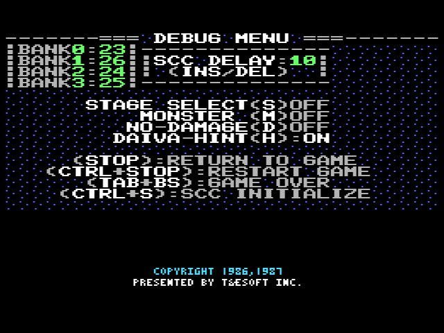

# SLAYDOCK_SCC

スーパーレイドック(MSX版)用のユーティリティです

機能:
- ROMカートリッジ無しでディスク版として動作させる
- SCC音源対応させる
- STOPキーでおまけメニューが出る  
  おまけメニューでは無敵やヒントスイッチ切替、ソフトリセットが出来る

> [!CAUTION]  
> SCC音源対応は、SCC用のデータを演奏するのではなく、
> PSGチャンネルの内容をSCCでも同時再生+エコーをかけるだけです。

ステージ切り替えなどの際にディスクロードが入ります。

起動時以外はROMカートリッジで動作させるバージョンもあったはずなのですが、どうやら紛失したようです。

## 対応機種

- MSX2+/turboR
  - マッパー対応RAM 64KB
  - VRAM128KB
  の条件を満たすなら一部のMSX2でも動作可能（A1F等）
- DOS2不可

ブート部分をROMから取り出して書き換えてRAMにおいて動かすため、
メモリマッパ対応メインRAM64KB以上搭載のMSXが対象になります。

ページ2(8000H-BFFFH)のメモリマッパ割り当てを、メモリマッパBIOSを経由せずに操作しているため、DOS2では正常動作しません。
（BDOSコール時にメモリマッパが強制変更されてしまう）

ターボRやNextor等で動作させたい場合、DOS1フォーマットしたディスクから起動するか、起動時から"1"キーを押し続けてDOS1モードで起動するなどの方法を取ってください。

### 参考：メモリマッパRAM搭載機種
- MSX2+、MSXターボR
- メモリマッパ搭載MSX2
  - Panasonic : FS-A1F、FS-A1FM
  - Sony : HB-F900、HB-T600
  - CANON : V-25、V-30F

## ROMカートリッジの*後挿し*について

実行用ディスクイメージの作成時に、  
電源を入れてBASICが立ち上がってから、ROMカートリッジを挿す操作が必要になります。  
（この操作を「*後挿し*」とします）

SCC搭載ゲームカートリッジを使用する際には、そちらも*後挿し*が必要になります。  
出来ればスナッチャー/SDスナッチャー付属のコナミサウンドカートリッジをお勧めします。

### *後挿し*の注意点

- *後挿し*をすると良く暴走します。  
- *後挿し*は電気的に破損する危険性があるので自己責任で行ってください。

### *後挿し*のコツ

- PAUSEキー

  PAUSE機能がある機種ではPAUSEした状態で挿すとある程度安定する気がしますが、気休め程度の差です。  
  また、PAUSEしていても*後挿し*による機材へのダメージの可能性は変わりません。

- スイッチ付きカートリッジ中継アダプタ

  世の中にはROMの電源供給ラインにスイッチを挟む*後挿し*支援カートリッジも存在するようです。

- 1chipMSX+OCM-PLD

  1chipMSX+OCM-PLD 3.xx以上の場合は、SHIFT+F12でスロット1端子を無効←→有効切替できるので、簡単安全に*後挿し*が可能です。

## 準備

起動前に、スーパーレイドックのROMイメージをファイルに書き出す必要があります。
（割り込みや起動セグメントを書き換えて流用します）

BASICが起動したら
1. `RUN"LAY-COPY.BAS"⏎`
2. スロット1にスーパーレイドックを*後挿し*

スロット1のスーパーレイドックを検出すると
自動的にROMイメージを`SLAYDOCK.DAT`へ書き出したのちに、
ディスク対応パッチを当てて書き換えます。

## 起動方法

BASICが起動したら
1. `RUN"S-L.BAS"⏎`
2. スロット2にSCCカートリッジを*後挿し*（SCCサウンド拡張を使わないなら不要）
3. HIT ANY KEY

ゲームが起動したらSTOPキーでおまけメニューが出ます。

## ソースコード

SRCフォルダにアセンブラソースコードが添付してあります。
当時はバッ活掲載のMSX2 sinmple ASM システムで製作していましたが、
添付のソースコードはtniasm用に変換してあります。

tniASM v0.45 [2 November 2011, final freeware Z80/R800/GBZ80 version]  
http://www.tni.nl/products/tniasm.html

## その他

改造・再配布は禁止しません。  
クレジット表示、連絡等も不要です。  

ただし、責任は一切持ちませんのでよしなにどうぞ。
