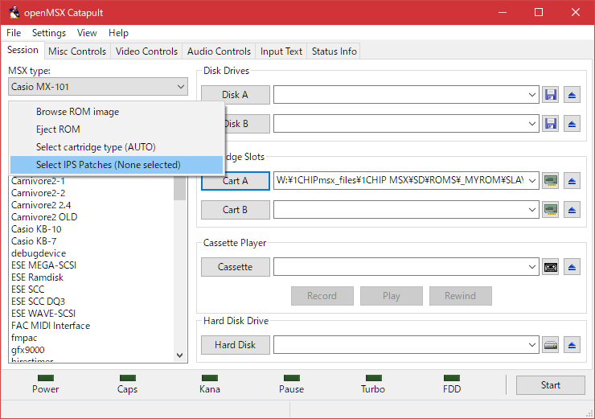

# Super LAYDOCK No damage patch (ips)

Super LAYDOCK ips file
- 1p No Damage
- 2p No Damage
- Docking No Damage

retail: [SuperLaydock_NoDamage.txt](SuperLaydock_NoDamage.txt)

## use ips patcher

eg.) winIPS [http://smblabo.web.fc2.com/](http://smblabo.web.fc2.com/)

## use openMSX

