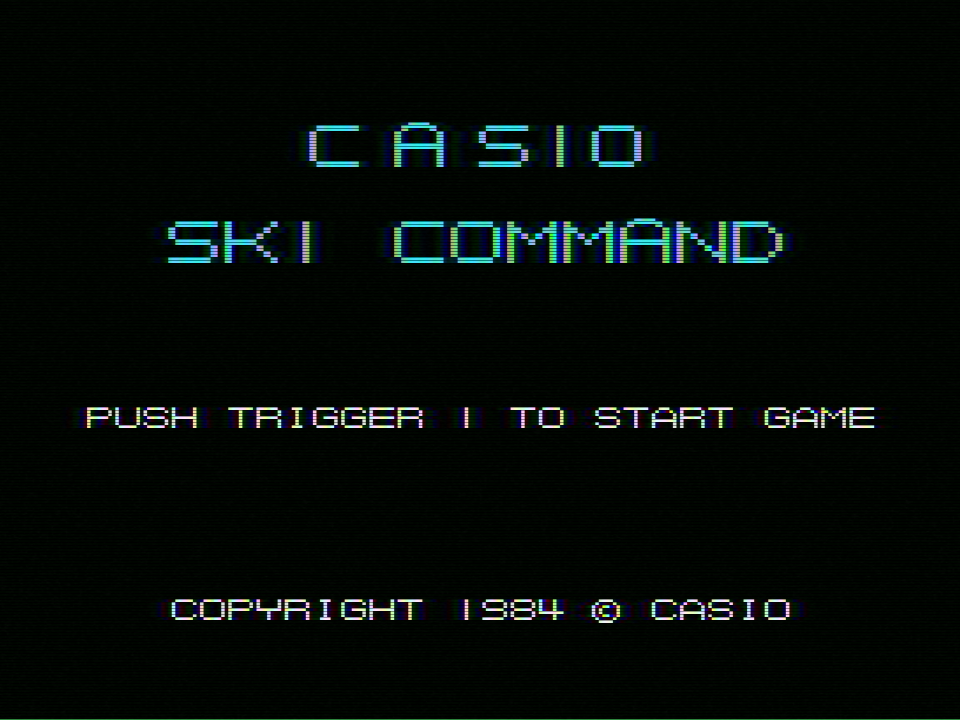
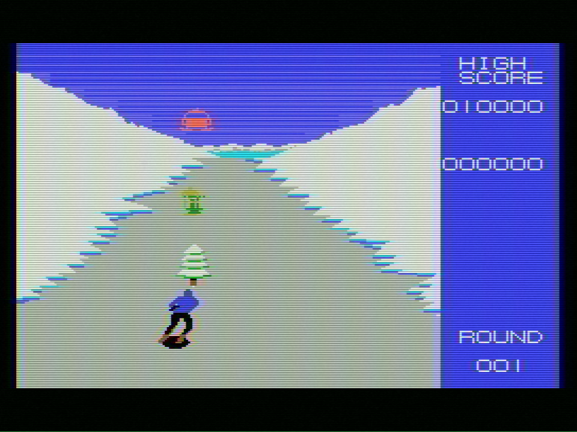
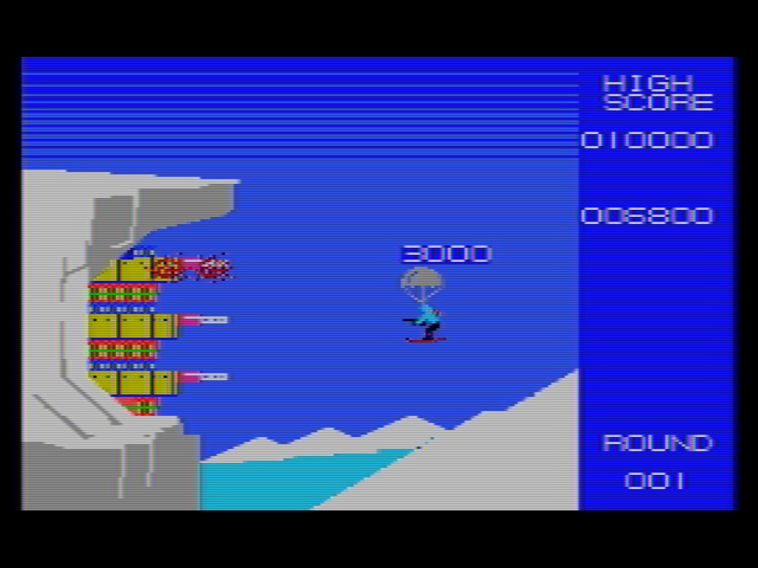

# スキーコマンドの暴走修正パッチ

隠れた名作MSX1用ソフト「スキーコマンド」  
（16KBROM CASIO 1984年発売）  
において、MSX2以降で暴走する問題を修正するパッチです。

(タイトルからアドバタイズデモ遷移時などでリセットがかかる問題）


[パッチダウンロード:SKICOMMF.ips](SKICOMMF.ips)





### 原因:元々バグったコードがある
```
 PUSH   AF             	;995A: F5       
 JR     Z,.X997C       	;995B: 28 1F    
   ↓ 
.X997C: 
 LD     DE,#1ADB       	;997C: 11 DB 1A
 JP     .X9739         	;997F: C3 39 97
   ↓ 
 .X9739: 
 CALL   .X989B         	;9739: CD 9B 98
 JR     NZ,.X9743      	;973C: 20 05
 LD     A,(#E90C)      	;973E: 3A 0C E9
 JR     .X9745         	;9741: 18 02
.X9743: 
 LD     A,#01          	;9743: 3E 01
.X9745: 
 LD     L,A            	;9745: 6F
 LD     H,#00          	;9746: 26 00
 CALL   .X9760         	;9748: CD 60 97
 LD     BC,#0003       	;974B: 01 03 00
 LD     HL,#E896       	;974E: 21 96 E8
 JP     LDIRVM         	;9751: C3 5C 00
    ; ここでLDIRVMからの戻りに暴走して0042へ飛ぶ
    ; 81f3に戻るべきだがAFの保存が残ったまま
    ; stack - f2fc: 0042
    ;         fcfe: 81f3
    ; MSX1やCBIOSは偶然暴走しないだけ
```
 
暴走時、ここで保存したAFの値($0042)が残っているので
`PUSH AF`を`JR Z,$997C`のあとに移動すれば良い。

```
 PUSH   AF             	;995A: F5       
 JR     Z,.X997C       	;995B: 28 1F    
```
これを↓に変更
```
 JR     Z,.X997C       	;995A: 28 20 ; 飛び先を+1する    
 PUSH   AF             	;995C: F5       
```


